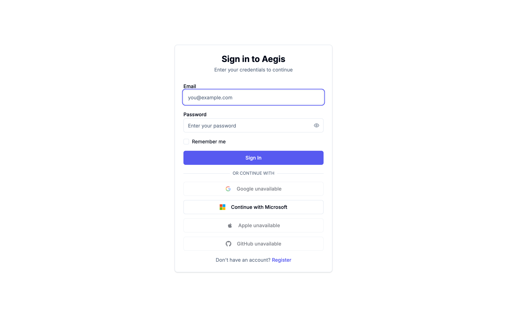
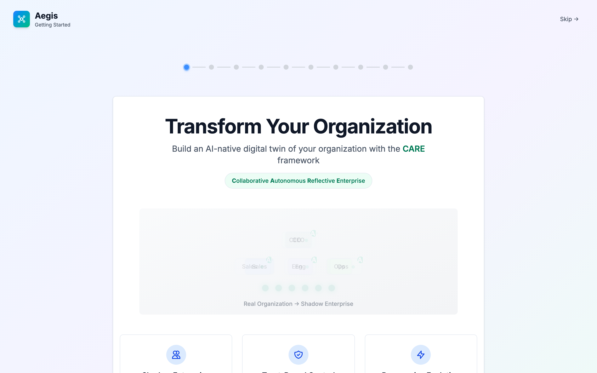
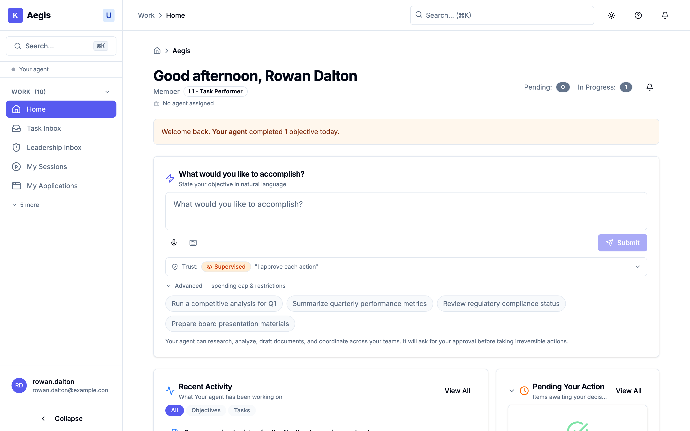

# 05.1 — First login

<!-- anchor-floor: ungrammatical (no anchor kind exists for a front-end route) -->

## What actually happens when you sign in

You will not land where you expect. Almost everyone's first sign-in goes to a
**Getting Started** walkthrough rather than to the main screen, and that is
deliberate. This chapter walks the first ten minutes in order.

## Signing in

The sign-in page is titled **"Sign in to Aegis"** and offers two ways in:

- **Email and password.** There is a "Remember me" tickbox and a show/hide
  control on the password field.
- **Single sign-on**, under a divider reading **"Or continue with"** — Google,
  Microsoft, Apple and GitHub.

Not all four sign-on buttons will necessarily work. If your organisation has not
enabled one, it appears greyed out reading **"{Provider} unavailable"**, and
hovering explains that provider is not available on this deployment. If a button
looks normal but fails, that is a different problem — see below.

_The sign-in page on the demo tenant. Three of the four sign-on buttons read
"unavailable" and are greyed out; only **Continue with Microsoft** is live,
because that is the only provider this deployment has enabled. Yours will differ.
Note the eye icon inside the password field, and the "Register" link at the
foot — both described above._

**Two more things to expect at sign-in:**

- **Multi-factor authentication follows your organisation's settings.** Where
  your organisation has enabled it, you are challenged for a second factor after
  your password. [immediate roadmap]
- **Rate limiting surfaces as a message rather than a separate page.** Get the
  password wrong repeatedly, or trip a rate limit, and you get a red message
  box — often _"Too many requests. Please wait a moment and try again."_ Wait,
  then try again.

**If sign-in fails**, a red box appears in the corner titled **"Login failed"**
with the reason underneath. The reason comes from the server, so it is usually
specific. If you arrived back at the sign-in page after being bounced from
single sign-on, the message is **"SSO Authentication Failed"** — start again, and
if it recurs, it is a configuration matter for whoever set up your organisation,
not something you can fix from this screen.

Validation on the form itself only runs when you press **Sign In** — it will not
nag you while typing.

## Getting Started: a walkthrough, not a setup form

Your first stop after signing in is a full-screen walkthrough. **It does not
configure anything.** It is ten short screens explaining how the system thinks:
what trust postures are, what a trust chain is, how agents are bounded, and what
the adoption phases mean. One screen introduces the agent assigned to you, if you
have one.

There is a **Skip** link in the top right. Skipping costs you nothing
functionally — nothing is left unconfigured — but chapters 2 and 4 of this
handbook will make considerably more sense if you spend the ten minutes.

_The first screen of the walkthrough — this is where most people land instead of
the main application. The row of dots is the progress indicator: twelve steps,
and you are on the first. **"Skip" is in the top right** and works from any step.
The panel introduces CARE — the Collaborative Autonomous Reflective Enterprise
framework, an open standard published by the Terrene Foundation that Aegis
implements._

> ### The walkthrough is remembered per browser
>
> Whether you finished or skipped it is remembered **in the browser you used**,
> not in your account. Sign in from a different browser, a different computer, or
> a private/incognito window, and the walkthrough appears again from the
> beginning.
>
> Nothing has been reset and you have lost nothing. Press **Skip**.

Until the walkthrough is finished or skipped, it stands in front of everything
else — you cannot navigate around it to the main screens.

## Your home screen

Past the walkthrough you arrive at your home screen, which greets you by name
with the time of day and shows your level and role.

If you are brand new, most of it is empty, and the empty states are worth
recognising so you do not think something is broken:

| Panel               | What a new account sees                                     |
| ------------------- | ----------------------------------------------------------- |
| Recent Activity     | _"No recent activity. Submit an objective to get started."_ |
| Pending Your Action | a green tick and _"All caught up!"_                         |
| In Progress         | _"No active objectives"_                                    |
| Agent status        | _"No agent assigned"_, if none has been                     |

The orange summary banner that regular users see across the top does not appear
until you actually have something pending or completed. Its absence is normal on
day one.

_Home, for a seeded demo user. Four things worth finding: the **greeting** with
your role beneath it (`Member`, `L1 - Task Performer`) and `No agent assigned`;
the **objective box**, which is the main thing you will use; the **trust
selector** under it, reading `Supervised — "I approve each action"`, which is
where you choose how much latitude the agent has for this piece of work; and the
counters top-right, here `Pending: 0` and `In Progress: 1`. The suggestion chips
below the box are starting points, not limits._

The centre of the screen is a box headed **"What would you like to accomplish?"**
That is the main thing you do here, and it is chapter 2.

Beneath it sit four example prompts — things like _"Run a competitive analysis
for Q1"_. Read them as **examples of the shape of a good request**, not as
suggestions tailored to you or to your organisation. They are the same four for
everybody.

## Finding your way around

The left-hand sidebar is filtered to you. **You will not see every section this
handbook or a colleague mentions**, and an item missing from your sidebar is
usually not a fault — it is a section you have not been given. Chapter 5 covers
how to tell that apart from something being broken.

Two navigation behaviours worth knowing now:

- Some items sit behind a **"Show more"** control in a section rather than at the
  top level. If you cannot find something named in this handbook, expand the
  section before concluding you lack access.
- **An unrecognised web address returns you to your usual landing page** rather
  than to an error screen. If you followed a link and ended up somewhere
  unexpected, the link was stale — nothing went wrong with your account.

**Value Chains** appears in the sidebar and opens shortly. [immediate roadmap]

## If your screen does not match a colleague's

Two accounts with the same job title can legitimately see different things,
because what you see depends on the role you were given, the organisational unit
you sit in, and your clearance. That is the system working as designed, and
chapter 5 explains the reasoning.

There is also a mechanical reason worth knowing: **what your account can see is
cached in the browser**, so the same account in two different browsers can
present differently until each refreshes. If your access looks wrong rather than
merely narrow — a section you used yesterday has gone — sign out fully and sign
back in, which refreshes it. If it persists after that, it is worth reporting.

---

_Next: [05.2 — Submitting an objective](02-submitting-an-objective.md)_
