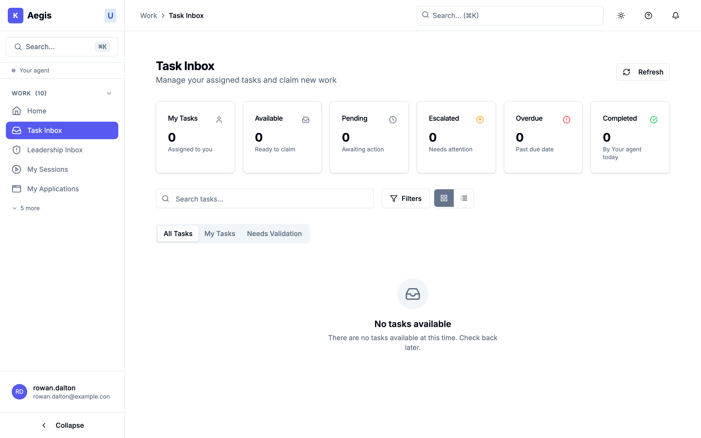
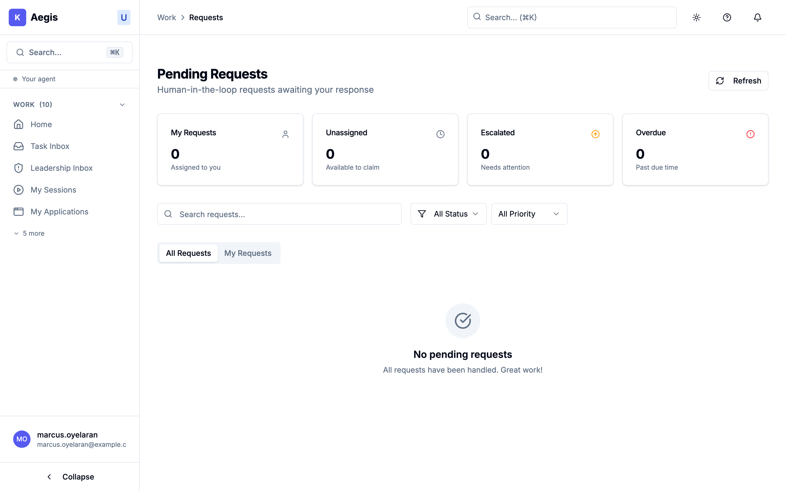

# 05.3 — Your inbox

<!-- anchor-floor: ungrammatical (no anchor kind exists for a front-end route) -->

## There are three of them, and they are not the same thing

This is the part of the interface most likely to confuse you, because "inbox"
appears three times in the sidebar and the three lists hold genuinely different
things. In short:

| Where                | What is in it                                             | What you do there                               |
| -------------------- | --------------------------------------------------------- | ----------------------------------------------- |
| **Task Inbox**       | pieces of work — yours, and unclaimed work you could take | claim it, work on it, complete it, hand it back |
| **Pending Requests** | an agent has asked a human for something and is waiting   | claim it and respond                            |
| **Leadership Inbox** | notifications routed to you because of your position      | read them                                       |

The first two are things to **do**. The third is things to **know**.

**You may not have all three.** Pending Requests in particular is shown to a
narrower set of people, and it sits behind the **"Show more"** control in the
sidebar rather than at the top level — so check there before concluding you do
not have it.

## Task Inbox

Six counters across the top — **My Tasks**, **Available**, **Pending**,
**Escalated**, **Overdue**, **Completed** — and three tabs: **All Tasks**, **My
Tasks**, and **Needs Validation**.

The distinction that matters is between work that is _yours_ and work that is
_available_. Unclaimed work sits in All Tasks; claiming it makes it yours and
takes it off everyone else's list. There is a confirmation step, because claiming
is a commitment other people can see.

On each card:

- **Claim** — take it.
- **Work on Task** — opens a working session and takes you into it.
- An overflow menu with **Complete**, **Reject**, **Release**, **Escalate** and
  **Delete**.

**Release** is the one people miss. If you claimed something you cannot finish,
release it rather than leaving it to go overdue — it returns to the available
pool. **Escalate** is for work that needs someone above you, not for work you
simply do not want.

_The Task Inbox on the demo tenant, and it is **empty** — all six counters at
zero and "No tasks available. There are no tasks available at this time." Read it
as "nothing for you here", never as "nothing here": a list emptied by your
permissions and a genuinely empty list are the same picture. The six counters and
the three tabs — All Tasks, My Tasks, Needs Validation — are the parts to learn
now, because they are where the numbers will appear when there is work._

### Reading urgency

Each card carries a priority — **Low**, **Normal**, **Medium**, **High** or
**Urgent**, with the top two in red — and a due date that turns red and reads
**"Overdue by …"** once it passes. Work that has been escalated is badged as
such.

**The list does not sort by priority.** Priority is shown, not enforced, so an
Urgent item can sit below routine work. Sort or filter yourself, and do not
assume the top of the list is the most important thing. (The **Pending Your
Action** panel on your home screen _does_ order by priority, which makes it the
better first glance of the day.)

## Pending Requests

Where an agent has stopped and asked a human for something. Four counters — **My
Requests**, **Unassigned**, **Escalated**, **Overdue** — a search box, and
filters for status and priority.

Rows are either assigned to someone, showing their avatar, or marked
**"Unassigned"**. The one action from the list is **Claim** on an unassigned
row; clicking through opens the request in full.

Statuses you will see: **Pending**, **Assigned**, **In Progress**,
**Completed**, **Escalated**, **Timeout**, **Cancelled**. **Timeout** means
nobody answered in time — the request expired rather than being decided, and
whatever was waiting on it did not get what it needed.

Empty, it reads _"All requests have been handled. Great work!"_

_Pending Requests, subtitled "Human-in-the-loop requests awaiting your response".
Also empty on the demo tenant. The reassuring copy — "All requests have been
handled. Great work!" — is worth noticing precisely because it is **not**
evidence that nothing was requested of anyone. It reports on what you can see._

## Leadership Inbox

Notifications routed to you because of where you sit in the organisation. It
polls every thirty seconds; there is no live push, so a brief delay is normal.

You can **Mark read** on a row, and toggle between **Show unread only** and
**Show read**. That is all — it is a record to be aware of, not a queue to work.
Rows carry a priority badge and a data-classification badge, and unread ones are
marked.

> ### The expanded row carries the underlying notification
>
> Expanding a row shows the raw underlying notification, including a block of
> technical data. You will see lines labelled **Event** and **Routing** written
> in system vocabulary rather than plain English.
>
> Read the summary, the priority and the classification badge; the technical
> block is there for when you are chasing something specific. If a notification
> matters and you need the event type decoded, the person who set up the routing
> can tell you what it means.

> **[SCREENSHOT]** id: `leadership-inbox-unread` ·
> route: `/agentic/leadership-inbox` · state: `northwind.inbox.unread` ·
> persona: `operations_director`
> _Must show:_ the unread/read toggle, priority and classification badges, and
> one row expanded — with any identifying values in the technical block
> obscured before publication.

## What "empty" does and does not tell you

Every one of these lists shows a cheerful empty state when it has nothing for
you: _"No tasks available"_, _"All caught up!"_, _"You're all caught up."_

**Read those as "nothing for you here", not as "nothing here".** These lists show
what you are entitled to see, and they do not tell you when something has been
filtered out — there is no "3 items not shown" notice anywhere. An empty list and
a list emptied by your permissions look identical.

This matters in one specific situation: a colleague says they have sent you
something, and your inbox is empty. That is not necessarily a bug and it is not
necessarily them being wrong — it can be a visibility boundary. Chapter 5 is
about how to tell, and what to do.

## A practical order for the morning

1. **Home screen, Pending Your Action** — it is the only list ordered by
   priority.
2. **Task Inbox, My Tasks** — check Overdue before Available.
3. **Pending Requests** — an agent is blocked on each of these, so they cost
   more than they look. A request that times out is work that failed waiting.
4. **Leadership Inbox** — awareness, not action. Last.

If something in any of these lists is stopped and waiting rather than simply
assigned to you, that is a **held** action, and it works differently. That is the
next chapter.

---

_Next: [05.4 — When something is held](04-when-something-is-held.md)_
