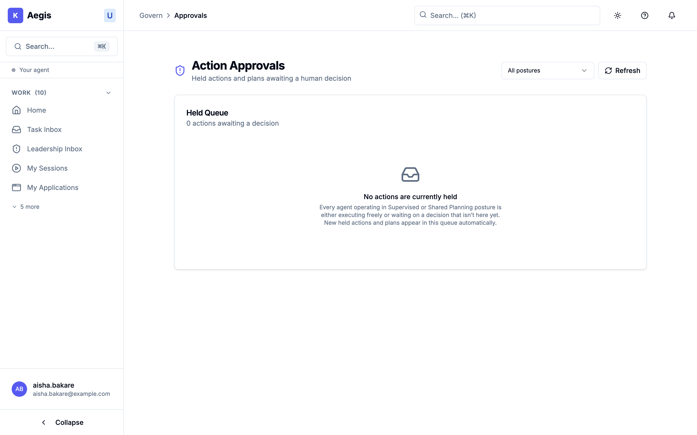

# 05.4 — When something is held

<!-- anchor-floor: ungrammatical (no anchor kind exists for a front-end route) -->

## Held means the system worked

An agent reached the edge of what it was allowed to do, stopped, and asked for a
person. Nothing has failed. Nothing is broken. The bounds were set deliberately,
and this is what reaching them looks like.

This is worth saying plainly because the experience does not feel like success.
Work you asked for has stopped, and a queue is asking you to decide something.
The instinct is to treat it as an obstruction. It is the opposite: an agent that
_could not_ be stopped at this point would be the thing to worry about.

The stopping itself is real and reliable — it is one of the controls this
platform enforces rather than merely records.

## Where held work lives

The queue lives at `/govern/approvals`, and the navigation entry that points at
it sits inside the **GOVERN** section. The page admits both the `admin` and the
`user` persona; a standing navigation entry for every persona it admits is on its
way. [immediate roadmap]

In the meantime, go to `/govern/approvals` directly in the address bar and it
will load. If it does not, you hold neither persona and you need an
administrator rather than a different URL.

**Action Approvals**, subtitled _"Held actions and plans awaiting a human
decision"_. The queue is headed **Held Queue** and refreshes itself every five
seconds — there is a badge saying so, and it is accurate. You do not need to
reload.

Empty, it reads **"No actions are currently held"**, and explains that agents
under supervision are either running freely or waiting on a decision that is not
in this queue.

> **[SCREENSHOT]** id: `approvals-held-queue-countdown` ·
> route: `/govern/approvals` · state: `northwind.approvals.pending` ·
> persona: `operations_director`
> _Must show:_ the Held Queue with one card — posture badge, request type,
> agent's reasoning, proposed action, and the countdown timer mid-way.

_The approvals queue with nothing in it — the state this chapter warns you not to
over-read. The page's own explanation is the important part: every agent in a
supervised or `shared_planning` posture "is either executing freely or waiting on a
decision that isn't here yet." **An empty queue is not proof that nothing was
held.** Note the "All postures" filter top-right: if you are looking for
something and not finding it, check that first._

## Reading a held item

Each card shows:

- **Which agent** stopped, and **the objective** it was working on.
- **Its posture** — **Supervised** or **Shared Planning**. This is the reason it
  stopped: an agent under supervision must ask.
- **What kind of decision** — a **Single Action** or a whole **Execution Plan**.
- **Agent's reasoning** — the agent's own account of why it wants to do this.
- **Proposed action** — the specific thing it wants to do.
- **Time left** — a live countdown.

### What the card tells you, and what it leaves to you

Three properties worth knowing, so you are not looking for things that are not
there:

**The reason is the agent's, not a policy's.** "Agent's reasoning" is the agent
explaining itself, and the posture badge is the whole answer to "why did this
stop" — it stopped because it is supervised. Where the agent supplied no
reasoning, the field reads **"No reasoning was provided."**

**It does not name a decider.** Anyone with access to the queue can act on any
item in it, which keeps a held action from waiting on one person's availability.
In practice that means **a held item is nobody's job unless someone makes it
theirs** — if your team relies on this queue, decide between you who watches it.

**"Requested by" shows an account identifier, not a person's name.** You may have
to ask who that is.

## The countdown, and what running out means

Each card shows **Time left**, counting down, amber under a minute and red under
thirty seconds. Expired, it reads **"Window closed"** with a blunt line: _"This
request should have timed out already — decide now or the agent will fail with a
timeout error."_

Take that literally. **A held action that is not decided does not wait forever
and does not proceed — it fails.** The work does not quietly continue without
approval, which is correct, but it also does not sit there indefinitely. Nobody
deciding is itself a decision, and it is the worst one available: the work fails
having consumed whatever it already spent.

If the timer cannot be worked out you will see **"Deadline unknown"**. Treat that
as urgent rather than as no deadline.

## Deciding

Two buttons: **Approve** and **Reject**. Afterwards you get a short
confirmation — _"Action approved / The agent has been notified and will
proceed."_ or _"Action rejected / The agent has been notified and will not
proceed."_

If it was **your** request, you also get **Withdraw request**, which cancels it.
That is the right move when you have changed your mind or realised the agent
misunderstood — better than rejecting, because it does not read as a judgement on
the agent's proposal.

> ### You cannot approve your own request
>
> The separation between requesting and approving is deliberate, and it is one
> of the things that makes the audit trail worth anything. The refusal is
> enforced on the server: pressing **Approve** on a card you raised yourself
> returns a red message reading **"Could not approve this action"**.
>
> Use **Withdraw request** if you want your own request gone, and find a
> colleague if it genuinely needs approving.

## Your work seems stuck. What to check.

**Start with the approvals queue.**

If your item is there, it is genuinely waiting for a person. Approve or reject it
and the _same_ action resumes from where it stopped; nothing is re-run and
nothing is lost. There is a **five-minute** window by default — past it the
request times out and the work does not proceed. If you are waiting on somebody
else, tell them. Do not assume they were notified.

⛔ **An empty queue does not mean nothing was held.** Work can stop _because_ a
human decision was required and there was nobody to ask. That stop, and the
reason for it, are reported on your session view alongside the ones that reach
the queue. [immediate roadmap]

| Approvals queue                   | What it means                                                    | What to do                                                                            |
| --------------------------------- | ---------------------------------------------------------------- | ------------------------------------------------------------------------------------- |
| Your item is there                | **Held and waiting** — someone must decide                       | Approve or reject, within five minutes                                                |
| Empty, session still shows active | It stopped because nobody could be asked, or it is still working | Re-submit under a posture with a human in the loop, which routes the same stop to you |
| Empty, session completed          | Nothing was held                                                 | —                                                                                     |

**The one-sentence version:** _the approvals queue shows the work that stopped to
wait for you; a stop with nobody to wait for is reported on the session — so read
both._

⚠ **Why the re-submit works.** A posture with a human in the loop routes the same
stop into the queue, where you can see it and act on it. That turns a question
you are waiting on into a decision you can make.

### Where a held state is recorded

Whether an action of yours is held is recorded and is retrievable through the
approvals interface, so an administrator — or you, on the approvals page — can
answer "is anything of mine held?" directly.

## What this is for

Every one of these decisions is recorded — who asked, what was proposed, who
decided, and when — in a tamper-evident trail. That record is the point.

Your organisation is accountable for what its agents do. That accountability
cannot be handed to a supplier, a platform or an agent, and "the AI did it" has
never been a defence. What Aegis provides is the **proof**: bounded mandates,
actions that stop at the boundary, and an evidence trail showing that a named
human decided the things that needed a human. You keep the accountability; the
system gives you what you need to show how you discharged it.

That is why a held action is worth the interruption. Approving something here is
not administrative friction — it is the moment the record captures a human
making a decision, which is exactly what an auditor, a regulator or an insurer
will later ask you to demonstrate.

---

_Next: [05.5 — What you can see, and why](05-what-you-can-see.md)_
